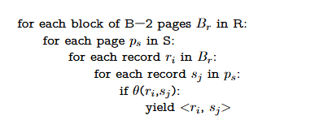

# Join & QueryOpt


# Join

合并两张表

## Simple Nested Loop Join （SNLJ）
最直接的 JOIN 的方法，实际上就是使用两个 for 循环去遍历两张表的所有 records ，
然后根据 join 的列是的值是否相等进行筛选

伪代码如下


这么做有什么问题？

还是那个问题，我们可以对这个算法进行 I/O 分析，我们发现，一个 R record 需要遍历所有的 s record。
我们可以计算出对应的 IO 次数为 $$ [R] + |R|[S] $$
其中 $ [R] $ 代表加载 R 表所需的 Page 数，$ |R| $ 为 R 的所有 record 数量。

这个 IO 是很浪费的，因此我们可以对其做出优化。不难发现，这个算法的浪费点在于，一个 R record 就需要遍历所有的 S record，但是我们加载下一个 R record 的时候，又需要再次遍历，因此我们的目的是减少这种冗余的加载。

## Page Nested Loop Join （PNLJ）

基本思想，可以将 R 和 S 两张表各自加载一个 Page 到内存中，然后只在 Page 中进行操作。


伪代码如下：


进行 IO 分析，不难得到结果为 $$ [R] + [R][S] $$
通过这种方式，我们降低了对 S 的重复加载。

## Block Nested Loop Join （BNSJ）

回顾一下 PNSJ，我们只用了 3 个 Page，两个用于输入，一个用于输出，没有完全利用好我们的内存，因此我们可以进一步优化。比如，我们可以加载 B-2 个 R Page 到内存中，伪代码如下：


IO 为 $$ [R] + \frac{[R]}{B-2} * [S] $$


## LAB-BNLJ

不难发现，PNLJ 实际上就是 B = 3 时的 BNLJ，因此我们可以只实现 BNLJ。

这一部分比较简单，首先是实现两个函数 `fetchNextLeftBlock()` 和 `fetchNextRightPage()`，这里需要注意的点是，我们在遍历的过程中是需要回溯的，所以要记得调用 `markNext()` 来进行标记，如下:
```java
private void fetchNextLeftBlock() {
    if (this.leftSourceIterator.hasNext()) {
        this.leftBlockIterator =
                getBlockIterator(
                        this.leftSourceIterator,
                        getLeftSource().getSchema(),
                        numBuffers - 2);
        this.leftBlockIterator.markNext();
        this.leftRecord = this.leftBlockIterator.next();
    }
}

private void fetchNextRightPage() {
    if (this.rightSourceIterator.hasNext()) {
        this.rightPageIterator = getBlockIterator(
                this.rightSourceIterator,
                getRightSource().getSchema(),
                1
        );
        this.rightPageIterator.markNext();
    }
}
```

接下来就是如何进行遍历了，这一部分只要对比伪代码图和给出的图片样例就会比较好思考：





基本思想：将伪代码中的内部两个循环看成 `this.leftBlockIterator` 和 `this.rightPageIterator` ，然后外部的两个循环看成 `fetchNextLeftBlock()` 和 `fetchNextRightPage()` ，然后注意 `reset()` 的时机就行（实际上就是循环的结束）：

```java
private Record fetchNextRecord() {
    if (this.leftRecord == null) {
        return null;
    }
    while (true) {
        if (this.rightPageIterator.hasNext()) {
            Record rightRecord = this.rightPageIterator.next();
            if (compare(leftRecord, rightRecord) == 0) {
                return leftRecord.concat(rightRecord);
            }
        }else if (this.leftBlockIterator.hasNext()) {
            this.leftRecord = this.leftBlockIterator.next();
            this.rightPageIterator.reset();
        }else {
            fetchNextRightPage();
            if (this.rightPageIterator.hasNext()) {
                this.leftBlockIterator.reset();
                this.leftRecord = this.leftBlockIterator.next();
                continue;
            }
            fetchNextLeftBlock();
            if (this.leftBlockIterator.hasNext()) {
                this.rightSourceIterator.reset();
                fetchNextRightPage();
                continue;
            }
            return null;
        }
    }
}

```